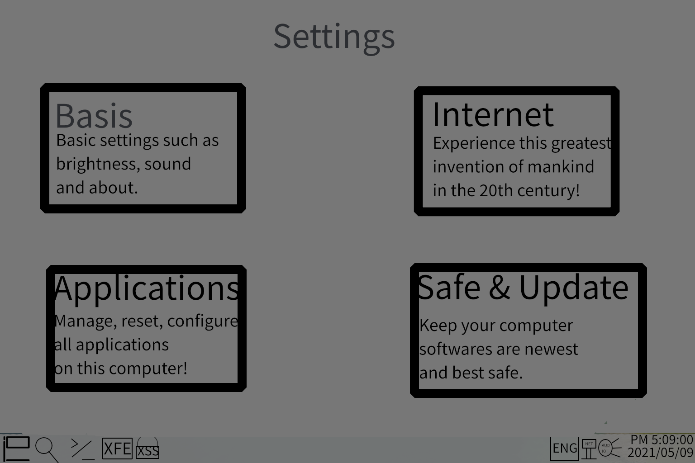

# The XES system.

## It's a system ,  height performance , easy using , very safe , open source system.

## Download addresses
 [Github Tag](https://github.com/ciurmilt/xes-x86/releases)

The tag have a R2(Cloudflare R2)'s download address , If your cloudflare speed is fast , Please download to R2.

If you don't know your R2 speed , please cleck [This](https://xsvoice.top/s) . Will download a 300MB file.

## For China user

If your in China , Your R2 and Tag all in slow.

But , we have a singapore server for you , can help you fast download.
# A SYSTEM

| Open Source        | Performance | Ease of use | Security | Size         |
| ------------------ | ----------- | ----------- | -------- | ------------ |
| By GPLv3.0 license | Height      | Easy        | Very     | about ½ 10GB |

## Why it is height performance?

### It using smart tasks admin program , Like this:

####  if CPU have a cores.

| A core                       | Two or Four cores  |
| ---------------------------- | ------------------ |
| All tasks are handled by it. | Split tasks evenly |

#### OR MORE THAN FOUR CPU CORES ?

just like this:

| A task             | Two tasks                                       |
| ------------------ | ----------------------------------------------- |
| For core 0 handled | Main T.1 to core 0 and 1 , T.2 to core 2 and 3. |

Repeat this.

#### How are the system and bottom layers handled?

| system core | Function                |
| ----------- | ----------------------- |
| XDW         | draw window             |
| XSF         | keep you security       |
| XPA         | performance admin tools |
| XOS         | admin others tasks      |

### And , Memory.

un... if now have a program in your memory , XES handles it this way:

if its using , xes can keep it in memory.

if its opened , but no using , xes will to it to /swap partition .

the swap partition , You can customize its size.

### What are its main file formats?

| formats | usefulness                |
| ----------- | ----------------------- |
| XPK         | XES pack             |
| XDF         | XES dependency files       |
| XEXEP         | XES executable program |
| XAC         | XES application configuration file      |

### How can I development a app for XES?
<iframe width="560" height="315" src="https://www.youtube.com/embed/Rt5xTLm6oHA?si=2XwaqtoCNsaO8H5H" title="YouTube video player" frameborder="0" allow="accelerometer; autoplay; clipboard-write; encrypted-media; gyroscope; picture-in-picture; web-share" referrerpolicy="strict-origin-when-cross-origin" allowfullscreen></iframe>

### User interface design.

#### default is this(you can feel free to change it):

#### notify:

#### settings:

#### start:

#### control center:

#### Desktop widgets:

#### Application list:
